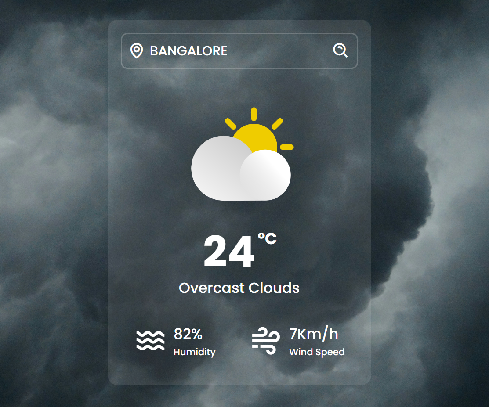
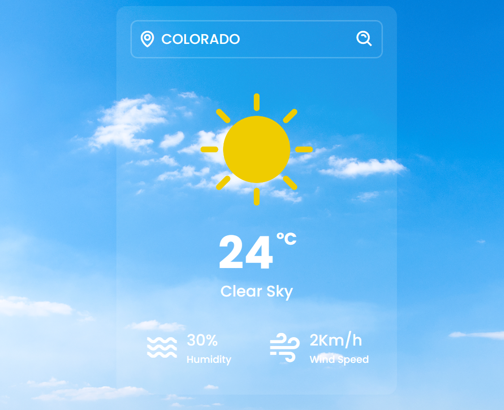

# Weather App

This simple web application allows users to check the current weather conditions for any location using the OpenWeatherMap API. Built with **HTML**, **CSS**, and **JavaScript**, it provides a clean and intuitive interface for viewing real-time weather information.

## Features

- Search for weather by city name.
- Display current temperature, weather conditions, and humidity.

### App Preview

 
 
 

